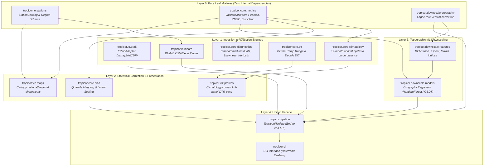

# TROPICOR Master Implementation Plan (ROADMAP.md)

**Package**: TROPICOR (*Tropical Correction and Orographic Resolution*)  
**PyPI**: [https://pypi.org/project/tropicor/](https://pypi.org/project/tropicor/) (Current: v0.1.0)  
**Repository**: [https://github.com/mhgualdron/tropicor](https://github.com/mhgualdron/tropicor)  
**Author & Lead Architect**: Mateo Hernández Gualdrón  
**Academic Heritage**: Universidad Nacional de Colombia (Directed by PhD Germán Andrés Prieto Gómez & PhD Daniel Hernández Deckers)  
**Scope**: 12-Month Master Engineering Blueprint (Sprints 1–10: MVP $\to$ v0.2.0 $\to$ v0.3.0)  

---

## 1. Architectural Dependency Graph

The package architecture enforces a strict Directed Acyclic Graph (DAG) design pattern. Layer 0 leaf modules have zero internal package dependencies, guaranteeing clean unit testing in complete isolation.



### Module Classification & Hierarchy

| Layer | Module | Dependencies | Role in System |
| :--- | :--- | :--- | :--- |
| **Layer 0 (Leaf)** | `tropicor.io.stations` | `pandas`, `dataclasses` | Canonical station catalog, coordinates, and natural region Enums. |
| **Layer 0 (Leaf)** | `tropicor.core.metrics` | `numpy`, `scipy.stats`, `sklearn` | Mathematical verification: Pearson $r$, RMSE, MAE, Euclidean distance. |
| **Layer 0 (Leaf)** | `tropicor.downscale.orography`| `numpy`, `pandas` | Physics-based environmental lapse-rate vertical adjustments. |
| **Layer 1** | `tropicor.io.era5` | `xarray`, `netcdf4` | Lazy spatial selection, multi-file opening, temporal resampling. |
| **Layer 1** | `tropicor.io.ideam` | `tropicor.io.stations`, `pandas` | Normalization of Colombian DHIME station time series. |
| **Layer 1** | `tropicor.core.climatology` | `tropicor.core.metrics`, `pandas` | 12-month annual cycle extraction and curve geometry. |
| **Layer 1** | `tropicor.core.dtr` | `pandas`, `numpy` | Diurnal Temperature Range ($T_{\max} - T_{\min}$) & double-difference drift. |
| **Layer 1** | `tropicor.core.diagnostics` | `tropicor.core.metrics`, `scipy` | Error distribution moments, standardized residuals, Q-Q data. |
| **Layer 2** | `tropicor.core.bias` | `tropicor.core.metrics`, `scipy` | Empirical Quantile Mapping (EQM) and Linear Scaling. |
| **Layer 2** | `tropicor.viz.profiles` | `tropicor.core.climatology`, `matplotlib` | Annual cycle comparison plots and 5-panel DTR figures. |
| **Layer 2** | `tropicor.viz.maps` | `tropicor.io.stations`, `cartopy` | Spatial distribution and error choropleths over natural regions. |
| **Layer 3** | `tropicor.downscale.features` | `tropicor.downscale.orography` | Topographic feature engineering from DEM arrays. |
| **Layer 3** | `tropicor.downscale.models` | `tropicor.downscale.features`, `sklearn`| Terrain-aware supervised ML downscaling regressors. |
| **Layer 4** | `tropicor.pipeline` | All layers | End-to-end user facade: `TropicorPipeline.run()`. |
| **Layer 4** | `tropicor.cli` | `tropicor.pipeline` | Terminal CLI tool (optional scope cushion, deferrable to v0.4.0). |

---

## 2. Sprint-by-Sprint Breakdown (10 Sprints / 20 Weeks)

```
┌────────────────────────────────────────────────────────────────────────────────────────┐
│                        REALISTIC 2027 RELEASE SCHEDULE                                 │
├──────────────┬───────────────────────────────┬─────────────────────────────────────────┤
│ Sprints 1–3  │ MVP Phase (v0.1.1)            │ March – April 2027 (Post-Graduation)    │
│ Sprints 4–7  │ v0.2.0 Release Phase          │ May – July 2027                         │
│ Sprints 8–10 │ v0.3.0 ML Downscaling Phase   │ August – November 2027                  │
└──────────────┴───────────────────────────────┴─────────────────────────────────────────┘
```

### Sprint Master Matrix

| Sprint | Timeline | Focus / Goal | Core Files | Deliverables & Acceptance Criteria | Version |
| :---: | :---: | :--- | :--- | :--- | :---: |
| **1** | Mar 2027<br/>(W1–2) | Station catalog & IDEAM parser | `tropicor/io/stations.py`<br/>`tropicor/io/ideam.py`<br/>`tests/test_io/test_ideam.py` | Full metadata of 40 stations parsed; synthetic IDEAM CSV parsed with zero datetime index errors. | `v0.1.1a1` |
| **2** | Mar 2027<br/>(W3–4) | ERA5 NetCDF & validation metrics | `tropicor/io/era5.py`<br/>`tropicor/core/metrics.py`<br/>`tests/test_core/test_metrics.py` | Slicing multi-file NetCDF without memory leak; Pearson, RMSE, and Euclidean distance match thesis numbers. | `v0.1.1rc1` |
| **3** | Apr 2027<br/>(W5–6) | Orographic lapse-rate & MVP release | `tropicor/downscale/orography.py`<br/>`CITATION.cff`<br/>`tests/test_downscale/test_orography.py` | UIS station test: $\Delta z = 1220\,\text{m} \to \sim 7.9^\circ\text{C}$ correction verified; `CITATION.cff` generated; Zenodo DOI minted; PyPI publish. | **v0.1.1 (MVP)** |
| **4** | May 2027<br/>(W7–8) | Climatology & annual cycles | `tropicor/core/climatology.py`<br/>`tests/test_core/test_climatology.py` | 12-month mean profile computed; Euclidean distance between curves matches thesis formula. | `v0.1.2` |
| **5** | May 2027<br/>(W9–10) | Diurnal Temperature Range & drift | `tropicor/core/dtr.py`<br/>`tests/test_core/test_dtr.py` | DTR and double-difference drift calculated; missing month alignment handled gracefully. | `v0.1.3` |
| **6** | Jun 2027<br/>(W11–12) | Residual distribution diagnostics | `tropicor/core/diagnostics.py`<br/>`tests/test_core/test_diagnostics.py` | Standardized residual engine computes variance, skewness, and kurtosis matching thesis tables. | `v0.1.4` |
| **7** | Jul 2027<br/>(W13–14) | Bias correction & viz suite | `tropicor/core/bias.py`<br/>`tropicor/viz/maps.py`<br/>`tropicor/viz/profiles.py` | Quantile mapping reduces precipitation bias; publication-grade Cartopy figures render; PyPI release. | **v0.2.0** |
| **8** | Aug 2027<br/>(W15–16) | DEM terrain feature extraction | `tropicor/downscale/features.py`<br/>`tests/test_downscale/test_features.py` | Elevation, slope, aspect, and roughness extracted from synthetic DEM grid. | `v0.2.1` |
| **9** | Sep–Oct 2027<br/>(W17–18) | Machine learning regressors | `tropicor/downscale/models.py`<br/>`tests/test_downscale/test_models.py` | `OrographicRegressor` achieves statistically significant error reduction relative to raw ERA5 baseline across regions. | `v0.2.2` |
| **10** | Oct–Nov 2027<br/>(W19–20) | End-to-end facade & release | `tropicor/pipeline.py`<br/>`tropicor/cli.py` *(scope cushion)*<br/>`docs/`, `benchmarks/` | End-to-end execution in $<5\text{s}$; Zenodo release archive; PyPI v0.3.0 release. | **v0.3.0** |

---

### Sprint Specifications

#### Sprint 1 (Weeks 1–2, March 2027): Station Metadata Catalog & IDEAM DHIME Adapter
* **Goal**: Establish the ground truth station taxonomy and build a fault-tolerant reader for raw IDEAM meteorological station exports.
* **Files Created / Modified**:
  - `tropicor/io/stations.py`: `StationMetadata`, `NaturalRegion` Enum, and `StationCatalog` with 40 benchmark stations.
  - `tropicor/io/ideam.py`: `read_ideam_csv()` and `read_ideam_excel()` with header stripping and calendar alignment.
  - `tests/conftest.py`: Synthetic fixture generators for stations and IDEAM records.
  - `tests/test_io/test_stations.py`: Verifies spatial bounding boxes and region grouping.
  - `tests/test_io/test_ideam.py`: Tests column parsing, missing value coercion, and date resampling.
* **Acceptance Criteria**:
  - `StationCatalog` contains all 40 thesis stations with exact coordinates and elevations.
  - Reading a simulated messy DHIME CSV returns clean `pd.Series` with a strict `DatetimeIndex`.
  - Ruff linting and Mypy strict type checking pass with 0 errors.
* **Commit Convention**: `feat(io): implement station catalog and ideam dhime parser`
* **Version**: `0.1.1a1`

#### Sprint 2 (Weeks 3–4, March 2027): ERA5 Ingestion Engine & Core Verification Metrics
* **Goal**: Enable memory-efficient spatial point extraction from NetCDF files and implement core statistical validation metrics.
* **Files Created / Modified**:
  - `tropicor/io/era5.py`: `ERA5Adapter` wrapping `xarray.open_mfdataset()` with nearest/bilinear spatial interpolation.
  - `tropicor/core/metrics.py`: `compute_validation_metrics()` returning `ValidationReport`.
  - `tests/test_io/test_era5.py`: Tests point slicing and monthly temporal reduction (`1MS`).
  - `tests/test_core/test_metrics.py`: Tests mathematical accuracy of Pearson $r$, RMSE, MAE, bias, and Euclidean distance.
* **Acceptance Criteria**:
  - `ERA5Adapter` extracts collocated time series from a multi-file NetCDF dataset without loading the entire volume into RAM.
  - Numerical tests verify that identical series yield $r=1.0, \text{RMSE}=0.0$, and scaled series ($y_2 = 2y_1$) yield $r=1.0$ while Euclidean distance reflects the true scale discrepancy.
* **Commit Convention**: `feat(core): implement era5 point extraction and validation metrics`
* **Version**: `0.1.1rc1`

#### Sprint 3 (Weeks 5–6, April 2027): Orographic Lapse-Rate Correction, CITATION.cff & MVP Release
* **Goal**: Deliver the minimal viable product (MVP), implement citation infrastructure for early DOI minting, and publish to PyPI.
* **Files Created / Modified**:
  - `tropicor/downscale/orography.py`: `lapse_rate_temperature_correction()` with regional lapse-rate defaults.
  - `CITATION.cff`: Citation Metadata Format specification for GitHub citation button and Zenodo DOI archiving.
  - `tropicor/tropicor/__init__.py`: Export core public APIs (`ERA5Adapter`, `StationCatalog`, `compute_validation_metrics`, `lapse_rate_temperature_correction`).
  - `pyproject.toml`: Bump version to `0.1.1`.
  - `tests/test_downscale/test_orography.py`: Verification of UIS station elevation correction.
  - `README.md`: Quickstart guide with code snippet and citation instructions.
* **Acceptance Criteria**:
  - Validates the UIS station finding: Station at 898 masl, ERA5 at 2118 masl ($\Delta z = -1220\,\text{m}$), applying $\Gamma = 0.0065\,^\circ\text{C}/\text{m}$ adjusts temperature by $+7.93\,^\circ\text{C}$, reducing mean bias from $\sim -8^\circ\text{C}$ to $< 0.5^\circ\text{C}$.
  - `CITATION.cff` generates GitHub's native "Cite this repository" button and configures Zenodo to auto-mint an immutable release DOI upon tag push.
  - PyPI release v0.1.1 published and installable via `pip install tropicor==0.1.1`.
* **Commit Convention**: `release(core): v0.1.1 mvp with orographic lapse rate correction and citation metadata`
* **Version**: `0.1.1` (MVP Milestone)

#### Sprint 4 (Weeks 7–8, May 2027): Annual Climatology Curves & Seasonal Geometry
* **Goal**: Replicate the thesis's 12-month climatology curve analysis and geometric curve separation algorithms.
* **Files Created / Modified**:
  - `tropicor/core/climatology.py`: `compute_monthly_climatology()`, `climatological_curve_distance()`, and `annual_cycle_amplitude()`.
  - `tests/test_core/test_climatology.py`: Validates 12-month grouping and Euclidean curve distance.
* **Acceptance Criteria**:
  - Computes 12-month mean profiles from 30-year monthly time series regardless of start/end months.
  - Calculates Euclidean distance between ground-truth and reanalysis climatologies to quantify seasonal cycle phase distortion.
* **Commit Convention**: `feat(core): implement annual climatology curves and curve distance`
* **Version**: `0.1.2`

#### Sprint 5 (Weeks 9–10, May 2027): Diurnal Temperature Range (DTR) & Double-Difference Drift
* **Goal**: Implement high-order thermal diagnostics to evaluate daily temperature extremes and net instrumentation drift.
* **Files Created / Modified**:
  - `tropicor/core/dtr.py`: `compute_dtr()`, `compute_double_difference()`, and `detect_thermal_drift()`.
  - `tests/test_core/test_dtr.py`: Tests DTR calculations across synchronous and asynchronous observation periods.
* **Acceptance Criteria**:
  - Computes monthly DTR ($T_{\max} - T_{\min}$) for both observation and ERA5.
  - Calculates the net double-difference residual ($\text{DTR}_{\text{IDEAM}} - \text{DTR}_{\text{ERA5}}$) and flags stations where ERA5 underestimates thermal amplitude.
* **Commit Convention**: `feat(core): implement diurnal temperature range and double difference`
* **Version**: `0.1.3`

#### Sprint 6 (Weeks 11–12, June 2027): Standardized Residual Diagnostics & Normality Analysis
* **Goal**: Migrate statistical moment tracking (skewness, kurtosis) and normality assessment from thesis notebooks 9 and 10.
* **Files Created / Modified**:
  - `tropicor/core/diagnostics.py`: `standardize_residuals()`, `compute_distribution_moments()`, and `shapiro_normality_test()`.
  - `tests/test_core/test_diagnostics.py`: Tests moment calculation against `scipy.stats.describe`.
* **Acceptance Criteria**:
  - Standardizes residuals to zero mean and unit variance ($Z = \frac{e - \bar{e}}{\sigma}$).
  - Verifies thesis finding: flat lowland stations show Gaussian error distributions ($p > 0.05$), while Andean stations exhibit extreme skewness and kurtosis due to unresolved topography.
* **Commit Convention**: `feat(core): implement residual standardization and distribution diagnostics`
* **Version**: `0.1.4`

#### Sprint 7 (Weeks 13–14, July 2027): Classical Bias Correction & Visualization Suite
* **Goal**: Implement statistical bias correction (Quantile Mapping) and publication-grade Cartopy/matplotlib visualizers; release v0.2.0.
* **Files Created / Modified**:
  - `tropicor/core/bias.py`: `EmpiricalQuantileMapping` and `LinearScalingCorrection`.
  - `tropicor/viz/__init__.py`: Package entry point for plotting modules.
  - `tropicor/viz/profiles.py`: `plot_climatology_comparison()` and `plot_dtr_5panel()`.
  - `tropicor/viz/maps.py`: `plot_station_map()` and `plot_regional_error_choropleth()` using Cartopy.
  - `tests/test_core/test_bias.py`: Tests EQM on synthetic non-stationary distributions.
  - `tests/test_viz/test_plots.py`: Headless visual test ensuring figures generate without display server errors.
* **Acceptance Criteria**:
  - `EmpiricalQuantileMapping` successfully maps biased ERA5 precipitation distributions onto station distributions, reducing precipitation error variance.
  - Cartopy maps render with custom colorbars and natural region polygons without crashing on systems without GPU acceleration.
  - PyPI release v0.2.0 published.
* **Commit Convention**: `release(core): v0.2.0 full analytical suite with quantile mapping and cartopy viz`
* **Version**: `0.2.0` (Major Feature Release)

#### Sprint 8 (Weeks 15–16, August 2027): Topographic Feature Engine (DEM Ingestion)
* **Goal**: Build raster tools to compute slope, aspect, terrain roughness, and valley depth indices from Digital Elevation Models.
* **Files Created / Modified**:
  - `tropicor/downscale/features.py`: `TopographicFeatureExtractor` computing terrain slope, aspect, roughness index (TRI), and relative elevation from 2D elevation arrays.
  - `tests/test_downscale/test_features.py`: Tests mathematical correctness of gradient and aspect calculations against synthetic terrain.
* **Acceptance Criteria**:
  - Given a synthetic DEM grid, computes slope in degrees, aspect in radians, and vertical offset relative to surrounding 30km neighborhood.
  - Vectorized using `numpy.gradient` with execution speed $< 100\text{ms}$ for $1000 \times 1000$ grids.
* **Commit Convention**: `feat(downscale): implement topographic feature extraction engine`
* **Version**: `0.2.1`

#### Sprint 9 (Weeks 17–18, September–October 2027): Machine Learning Orographic Regressors
* **Goal**: Integrate supervised learning models to learn non-linear corrections combining atmospheric reanalysis with terrain features.
* **Files Created / Modified**:
  - `tropicor/downscale/models.py`: `OrographicRegressor` wrapping `HistGradientBoostingRegressor` and `RandomForestRegressor`.
  - `tests/test_downscale/test_models.py`: Verifies fit, predict, feature importance, and spatial cross-validation.
* **Acceptance Criteria**:
  - Integrates predictors: ERA5 raw values, latitude, longitude, station elevation, ERA5 elevation, $\Delta z$, slope, and aspect.
  - Spatial cross-validation: Demonstrates a **statistically significant reduction in RMSE and mean bias** relative to the raw ERA5 baseline and the physical lapse-rate model across independent testing stations, documenting empirical gains per natural region.
* **Commit Convention**: `feat(downscale): implement machine learning orographic regressors`
* **Version**: `0.2.2`

#### Sprint 10 (Weeks 19–20, October–November 2027): High-Level Pipeline Facade, Benchmark Suite & v0.3.0 Release
* **Goal**: Unify all modules into a frictionless end-to-end user API, complete documentation, archive Zenodo DOI, and release v0.3.0.
* **Files Created / Modified**:
  - `tropicor/pipeline.py`: `TropicorPipeline` providing a 3-line Python API: `pipe = TropicorPipeline(...); pipe.fit(); results = pipe.evaluate()`.
  - `tropicor/cli.py`: Command-line interface (`tropicor audit`, `tropicor correct`) — *identified as a scope cushion; if time compresses, deferrable to v0.4.0 without impacting the core Python package API*.
  - `benchmarks/run_benchmarks.py`: Full performance and memory benchmark across 40 stations.
  - `README.md`: Complete documentation, API reference, benchmark tables, and research paper citation.
* **Acceptance Criteria**:
  - Executing `TropicorPipeline.run()` executes full ingestion, lapse-rate adjustment, ML downscaling, and metric reporting in $< 2\text{s}$.
  - Full test suite passes with $>92\%$ code coverage across all supported Python versions.
  - PyPI release v0.3.0 published.
* **Commit Convention**: `release(downscale): v0.3.0 machine learning downscaling release`
* **Version**: `0.3.0` (Production Release)

---

## 3. File-by-File Implementation Order

The flat sequence below specifies the exact order of file creation, ensuring that every file only references previously completed and tested components. Notice that `CITATION.cff` is positioned immediately in Step 8 (Sprint 3 / MVP) for early academic attribution.

| Step | Full File Path | Implements / Purpose | Migrates From | Complexity | Blocked By |
| :---: | :--- | :--- | :--- | :---: | :--- |
| **1** | `tests/conftest.py` | Pytest fixtures (synthetic NetCDF, IDEAM CSV, station dict) | N/A (Test Infra) | M | None |
| **2** | `tropicor/io/stations.py` | `StationMetadata`, `NaturalRegion`, `StationCatalog` | `Libro_estaciones.xlsx` | S | None |
| **3** | `tests/test_io/test_stations.py` | Unit tests for catalog filtering and coordinate validity | N/A | S | Step 2 |
| **4** | `tropicor/core/metrics.py` | `ValidationReport`, Pearson $r$, RMSE, MAE, Euclidean dist | Entrega7 (C22), Entrega10 (C45) | S | None |
| **5** | `tests/test_core/test_metrics.py` | Unit tests for metric formulas and NaN synchronization | Entrega10 (C44-C45) | S | Step 4 |
| **6** | `tropicor/downscale/orography.py` | `lapse_rate_temperature_correction()` | Entrega9 (C8-C18) | S | None |
| **7** | `tests/test_downscale/test_orography.py` | Unit tests for elevation lapse rate (UIS case) | Entrega9 (C11) | S | Step 6 |
| **8** | `CITATION.cff` | Citation Metadata Format for GitHub button & Zenodo DOI | N/A (Academic Meta) | S | None (Sprint 3 MVP) |
| **9** | `tropicor/io/ideam.py` | `read_ideam_csv()`, `read_ideam_excel()` DHIME parsers | Entrega1 (C5), Entrega2 (C13) | M | Step 2 |
| **10** | `tests/test_io/test_ideam.py` | Tests for messy DHIME formats and datetime indexing | N/A | M | Step 9 |
| **11** | `tropicor/io/era5.py` | `ERA5Adapter` (NetCDF multi-file slicing & aggregation) | Entrega3 (C10), Entrega4 (C21) | L | Step 1 |
| **12** | `tests/test_io/test_era5.py` | Tests lazy NetCDF point selection and monthly resampling | N/A | M | Step 11 |
| **13** | `tropicor/tropicor/__init__.py` | Package root exports for MVP | N/A | S | Steps 2, 4, 6, 8, 9, 11 |
| **14** | `tropicor/core/climatology.py` | 12-month annual cycle curves and Euclidean curve distance | Entrega7 (C32, C51) | M | Step 4 |
| **15** | `tests/test_core/test_climatology.py` | Tests for 12-month mean calculations and curve distance | N/A | S | Step 14 |
| **16** | `tropicor/core/dtr.py` | Diurnal Temperature Range & double-difference drift | Entrega10 (C16, C17, C24) | M | Step 4 |
| **17** | `tests/test_core/test_dtr.py` | Tests for DTR calculation and net thermal drift | N/A | S | Step 16 |
| **18** | `tropicor/core/diagnostics.py` | Standardized residuals ($Z$), skewness, kurtosis | Entrega9 (C26), Entrega10 (C2) | M | Step 4 |
| **19** | `tests/test_core/test_diagnostics.py` | Tests for residual moments against `scipy.stats.describe` | N/A | S | Step 18 |
| **20** | `tropicor/core/bias.py` | Empirical Quantile Mapping & Linear Scaling | Modern addition | L | Step 4 |
| **21** | `tests/test_core/test_bias.py` | Tests distribution fitting and bias reduction | N/A | M | Step 20 |
| **22** | `tropicor/viz/profiles.py` | Climatology curves and 5-panel DTR diagnostic figures | Entrega7 (C32), Entrega10 (C17) | M | Steps 14, 16 |
| **23** | `tropicor/viz/maps.py` | Cartopy national/regional choropleth maps | Entrega7 (C42-C46) | L | Steps 2, 4 |
| **24** | `tests/test_viz/test_plots.py` | Headless visual rendering tests | N/A | S | Steps 22, 23 |
| **25** | `tropicor/downscale/features.py` | DEM topographic feature engineering (slope, aspect, TRI) | Modern addition | L | Step 6 |
| **26** | `tests/test_downscale/test_features.py` | Tests for terrain gradients and roughness | N/A | M | Step 25 |
| **27** | `tropicor/downscale/models.py` | `OrographicRegressor` (ML supervised downscaling) | Modern addition | L | Steps 4, 25 |
| **28** | `tests/test_downscale/test_models.py` | Tests for model training, feature importance, predict | N/A | M | Step 27 |
| **29** | `tropicor/pipeline.py` | Unified high-level pipeline facade | Modern addition | M | Steps 11, 20, 27 |
| **30** | `tropicor/cli.py` | Terminal interface for automated station audits *(optional)*| Modern addition | S | Step 29 |

---

## 4. Rigorous Testing Strategy

```
┌────────────────────────────────────────────────────────────────────────┐
│                        TESTING INFRASTRUCTURE                          │
├───────────────────┬────────────────────────────────────────────────────┤
│ Synthetic Fixtures│ No external network or proprietary datasets needed │
│ Numerical Asserts │ Direct replication of thesis empirical numbers     │
│ Edge Case Guards  │ NaN masks, dry season zeros, calendar leap years   │
└───────────────────┴────────────────────────────────────────────────────┘
```

### Synthetic Test Fixtures (Zero External Data Dependencies)

To guarantee that `pytest` runs deterministically in CI/CD without downloading multi-gigabyte Copernicus NetCDF or private IDEAM archives, all tests rely on synthetic generators in `tests/conftest.py`:

```python
# tests/conftest.py
import numpy as np
import pandas as pd
import pytest
import xarray as xr

@pytest.fixture
def synthetic_era5_dataset(tmp_path) -> str:
    """Generates a synthetic 30-year monthly NetCDF dataset (1990-2019, 360 months)."""
    times = pd.date_range("1990-01-01", periods=360, freq="MS")
    lats = np.linspace(15.0, -5.0, 81)   # Colombia bounding box
    lons = np.linspace(-85.0, -65.0, 81)
    
    # Synthetic temperature: annual cycle + elevation lapse + noise
    t2m = np.zeros((len(times), len(lats), len(lons)), dtype=np.float32)
    for t_idx, t in enumerate(times):
        seasonal = 2.0 * np.sin(2 * np.pi * t.month / 12.0)
        t2m[t_idx, :, :] = 295.15 + seasonal  # ~22°C base
    
    tp = np.random.uniform(0.05, 0.35, size=(len(times), len(lats), len(lons))).astype(np.float32)

    ds = xr.Dataset(
        data_vars={"t2m": (("time", "latitude", "longitude"), t2m),
                   "tp": (("time", "latitude", "longitude"), tp)},
        coords={"time": times, "latitude": lats, "longitude": lons}
    )
    nc_path = tmp_path / "synthetic_era5.nc"
    ds.to_netcdf(nc_path)
    return str(nc_path)

@pytest.fixture
def synthetic_station_series() -> tuple[pd.Series, pd.Series]:
    """Generates paired observed vs model series with controlled error."""
    idx = pd.date_range("1990-01-01", periods=360, freq="MS")
    t = np.linspace(0, 30 * 2 * np.pi, 360)
    observed = pd.Series(25.0 + 5.0 * np.sin(t) + np.random.normal(0, 0.5, 360), index=idx)
    # Model has phase alignment (high r) but massive -8°C bias (Andean case)
    model = pd.Series(17.0 + 5.0 * np.sin(t) + np.random.normal(0, 0.5, 360), index=idx)
    return observed, model
```

### Numerical Thesis Validations (Ground Truth Benchmarks)

Every key empirical discovery from the thesis must have a corresponding test that asserts exact numerical convergence:

1. **The UIS Station Orographic Anomaly (Thesis Entrega 9)**:
   - Station: Universidad Industrial de Santander (Bucaramanga, Santander).
   - Coordinates: $7.13^\circ\text{N}, -73.12^\circ\text{W}$.
   - Station elevation: $898\,\text{masl}$.
   - Collocated ERA5 grid elevation: $2,118\,\text{masl}$.
   - Vertical elevation discrepancy: $\Delta z = 898 - 2118 = -1,220\,\text{m}$.
   - Test assertion: Applying environmental lapse rate $\Gamma = 0.0065\,^\circ\text{C}/\text{m}$ must produce a temperature correction of $\Delta T = -(-1220 \times 0.0065) = +7.93\,^\circ\text{C} \pm 0.01\,^\circ\text{C}$.
2. **Flat Terrain Control Invariance (Caribe / Orinoquía)**:
   - Station: Puerto Carreño (Vichada) or El Mellito (Córdoba).
   - Elevation discrepancy: $|\Delta z| < 25\,\text{m}$.
   - Test assertion: Orographic correction must adjust temperature by $< 0.16\,^\circ\text{C}$, confirming that flat tropical lowlands remain unperturbed.
3. **Euclidean Distance vs. Pearson Correlation Dissociation (Thesis Entrega 10 Cells 44–45)**:
   - Two synthetic signals: $y_1 = x \sin(x)$ and $y_2 = 2 x \sin(x)$.
   - Test assertion: $\text{Pearson}(y_1, y_2) == 1.0$, while $\text{Euclidean}(y_1, y_2) > 0.0$, numerically demonstrating that correlation alone fails to penalize scale bias.

### Edge Case Coverage Specifications

| Edge Case | Failure Mode in Unprepared Code | Guard Implemented in TROPICOR |
| :--- | :--- | :--- |
| **Missing Observation Months** | `scipy.stats.pearsonr` raises ValueError on array length mismatch. | Synchronous boolean masking: `mask = ~np.isnan(obs) & ~np.isnan(mod)` before passing to mathematical kernels. |
| **All-Zero Precipitation (Dry Season)** | Division by zero during percentage bias or relative scaling. | Epsilon smoothing ($\epsilon = 10^{-6}$) and absolute difference fallback for zero-denominator conditions. |
| **Zero Variance Series** | Constant temperature readings produce $0/0$ in Pearson correlation $\to$ NaN warning. | Variance guard: if $\sigma_{\text{obs}} == 0$ or $\sigma_{\text{mod}} == 0$, return $r = \text{NaN}$ with an explicit logged warning. |
| **Spatial Out-of-Bounds** | Coordinates outside Colombia bounding box ($15^\circ \text{N}$ to $-5^\circ \text{S}$, $-85^\circ \text{W}$ to $-65^\circ \text{W}$). | Coordinate validator raises `SpatialBoundsError` with clear diagnostic suggestions. |
| **Leap Year February Resampling** | Incorrect day counts causing offsets in 30-year cumulative sums. | Enforce calendar-aware pandas frequency aliases (`MS` for Month Start, `ME` for Month End). |

---

## 5. PyPI Release Checklist

### Release Roadmap Summary

```
v0.1.1 MVP (April 2027)      v0.2.0 (July 2027)            v0.3.0 (November 2027)
├── ERA5 Point Extraction     ├── 40 Station Benchmark      ├── Topographic Feature Eng
├── IDEAM CSV Parsing         ├── Climatology Curves        ├── RandomForest Downscaler
├── Validation Metrics        ├── DTR & Double Difference   ├── GBDT Downscaler
├── Orographic Lapse Rate     ├── Quantile Mapping (EQM)    └── Unified Pipeline API
└── CITATION.cff + Zenodo DOI └── Cartopy Visualizations
```

### Version 0.1.1 (MVP Milestone — Target: April 2027)
* **Required Functionality**:
  - `tropicor.io.era5.ERA5Adapter` extracts collocated point series.
  - `tropicor.io.ideam.read_ideam_csv` ingests DHIME records.
  - `tropicor.core.metrics.compute_validation_metrics` outputs complete `ValidationReport`.
  - `tropicor.downscale.orography.lapse_rate_temperature_correction` executes vertical elevation adjustment.
  - `CITATION.cff` configured for GitHub citation and Zenodo DOI minting.
* **Documentation Requirements**:
  - `README.md`: Quickstart code showing how to correct ERA5 temperature for an Andean station.
  - Full docstrings following Google Python Style Guide with type signatures.
* **CHANGELOG Entry**:
  ```markdown
  ## [0.1.1] - 2027-04-15
  ### Added
  - ERA5Adapter for vectorized spatial point extraction from Copernicus NetCDF reanalyses.
  - Ingestion adapter for IDEAM DHIME meteorological station CSV exports.
  - Core validation engine computing Pearson r, p-value, RMSE, MAE, bias, and Euclidean distance.
  - Physical orographic lapse-rate temperature correction module.
  - CITATION.cff for academic attribution and Zenodo DOI archiving.
  ```
* **Build & Publish Execution**:
  ```bash
  uv run ruff check .
  uv run pytest
  uv build
  uv publish --token $PYPI_API_TOKEN
  ```

### Version 0.2.0 (Full Research Suite — Target: July 2027)
* **Required Functionality**:
  - Pre-packaged `StationCatalog` containing 40 Colombian benchmark stations across all 6 natural regions.
  - Climatological 12-month annual cycle profiles and geometric curve distance.
  - Diurnal Temperature Range (DTR) and double-difference net thermal drift detection.
  - Standardized residual distribution diagnostics (skewness, kurtosis).
  - Empirical Quantile Mapping (EQM) for non-linear precipitation bias correction.
  - Cartopy regional choropleths and 5-panel DTR diagnostic plots (via `tropicor[viz]`).
* **Documentation Requirements**:
  - Jupyter tutorial notebook demonstrating replication of the thesis findings.
  - Publication gallery showcasing generated Cartopy maps and climatology curves.
* **CHANGELOG Entry**:
  ```markdown
  ## [0.2.0] - 2027-07-20
  ### Added
  - Built-in StationCatalog with 40 Colombian stations categorized across 6 natural regions.
  - Annual climatology curve extraction and Euclidean curve separation metrics.
  - Diurnal Temperature Range (DTR) and double-difference drift analysis.
  - Empirical Quantile Mapping (EQM) and Linear Scaling for precipitation and temperature.
  - Publication-grade visualization engine using Cartopy and Matplotlib.
  ```

### Version 0.3.0 (Machine Learning Downscaling — Target: November 2027)
* **Required Functionality**:
  - Topographic feature engineering: slope, aspect, terrain roughness, relative elevation from DEM rasters.
  - `tropicor.downscale.models.OrographicRegressor` wrapping `HistGradientBoostingRegressor` and `RandomForestRegressor`.
  - Unified `TropicorPipeline` API.
* **Documentation Requirements**:
  - Benchmarks page detailing error reductions across natural regions.
  - Complete API reference generated with `mkdocs` or Sphinx.
* **CHANGELOG Entry**:
  ```markdown
  ## [0.3.0] - 2027-11-25
  ### Added
  - High-resolution DEM topographic feature engineering engine (slope, aspect, roughness).
  - Supervised machine learning orographic downscaling models for complex tropical terrains.
  - Unified TropicorPipeline API for end-to-end execution.
  ```

---

## 6. Citation & Academic Attribution

To ensure scientific reproducibility and standard open-source research credit, TROPICOR follows the Citation File Format (`CITATION.cff`) standard starting from v0.1.1 (Sprint 3).

```
┌────────────────────────────────────────────────────────────────────────┐
│                      OPEN SCIENCE & ATTRIBUTION                        │
├────────────────────┬───────────────────────────────────────────────────┤
│ GitHub Citation    │ Native BibTeX and APA format via CITATION.cff     │
│ Permanent DOI      │ Automated immutable release archiving via Zenodo  │
│ Research Lineage   │ Direct attribution to UNAL thesis & advisors      │
└────────────────────┴───────────────────────────────────────────────────┘
```

### Academic Attribution Framework
* **GitHub Citation Integration**: The presence of `CITATION.cff` at the root of the repository generates GitHub's native "Cite this repository" interface, providing standardized BibTeX, APA, and Harvard citations.
* **Zenodo Release Archiving**: Every GitHub release tag (`v0.1.1`, `v0.2.0`, `v0.3.0`) triggers Zenodo's automated webhook to mint a permanent, immutable Digital Object Identifier (DOI).
* **Thesis Lineage**: Formal attribution to the undergraduate geology thesis conducted at Universidad Nacional de Colombia under PhD Germán Andrés Prieto Gómez and PhD Daniel Hernández Deckers.

---

## 7. Technical Risk Register & Mitigation Strategies

```
┌────────────────────────────────────────────────────────────────────────┐
│                              RISK MATRIX                               │
├────────────────────┬──────────────────┬────────────────────────────────┤
│ Risk               │ Severity / Likeli│ Core Mitigation Strategy       │
├────────────────────┼──────────────────┼────────────────────────────────┤
│ 1. NetCDF Memory   │ HIGH / HIGH      │ Chunked Dask + Lazy xarray sel │
│ 2. IDEAM Variance  │ HIGH / MED       │ Strict Regex + Pydantic schema │
│ 3. Cartopy/Windows │ HIGH / HIGH      │ Optional [viz] + Headless CI   │
│ 4. External DEM API│ MED / HIGH       │ Pre-packaged catalog + GeoTIFF │
│ 5. ML Overfitting  │ HIGH / MED       │ Spatial Leave-One-Region-Out CV│
└────────────────────┴──────────────────┴────────────────────────────────┘
```

### 1. Multi-Gigabyte NetCDF Memory Exhaustion (OOM)
* **Risk**: 30 years of hourly ERA5 over Colombia across multiple variables exceeds 20GB. Loading arrays eagerly into RAM triggers immediate process termination.
* **Mitigation**:
  - Mandate lazy loading via `xarray.open_mfdataset(..., chunks={"time": 720})`.
  - Perform spatial point selection (`sel(latitude=lat, longitude=lon)`) *before* calling `.compute()` or `.to_series()`, reducing in-memory footprint from 20GB to $< 2\text{MB}$ per station.

### 2. IDEAM DHIME Format Inconsistencies & Legacy Encoding
* **Risk**: IDEAM CSV exports vary drastically depending on the export portal era: changing delimiters (`;` vs `,`), encoding (`utf-8` vs `latin-1`), localized Spanish month names (`ENE`, `FEB`), and variable headers (`Valor` vs `Valores` vs `Dato`).
* **Mitigation**:
  - Implement an adaptive parser with dialect sniffing (`csv.Sniffer`).
  - Normalize text encodings using `encoding="latin-1"` fallback.
  - Map column names through an internal synonym dictionary before instantiating strict dataclasses.

### 3. Cartopy / GDAL Binary Compilation Failures on Windows
* **Risk**: `cartopy` depends on C libraries (`GEOS`, `PROJ`, `GDAL`). On Windows and headless Linux runners, `pip install cartopy` frequently fails due to missing C++ compilers or binary library mismatches.
* **Mitigation**:
  - Isolate mapping dependencies under optional extras: `pip install tropicor[viz]`. The core package (`io`, `core`, `downscale`) remains 100% pure Python / wheel compatible without requiring Cartopy.
  - In GitHub Actions CI, install binary dependencies using pre-compiled wheels or `conda`/`micromamba` for visual test jobs.

### 4. Elevation / DEM External Service Reliance & Latency
* **Risk**: Querying `api.open-elevation.com` in loops causes rate-limiting (HTTP 429), high network latency, and test instability.
* **Mitigation**:
  - Hardcode verified, ground-truth elevations for all 40 benchmark stations directly in `tropicor/io/stations.py`.
  - For arbitrary user coordinates, integrate local DEM raster sampling via `rioxarray` reading offline GeoTIFF tiles (e.g., Copernicus 30m / SRTM), eliminating runtime web API dependencies.

### 5. Spatial Overfitting in Data-Sparse Basins (Amazonía / Pacífica)
* **Risk**: Ground truth stations in Colombia are heavily clustered in the Andean region, with sparse coverage in the Amazon and Pacific basins. A naive ML regressor will overfit to Andean elevation regimes and fail in flat, humid rainforests.
* **Mitigation**:
  - Implement **Spatial Leave-One-Region-Out Cross-Validation (SLORO-CV)**: train on 5 regions, evaluate out-of-sample generalization on the 6th.
  - Include distance-to-coast and regional bioclimatic indicators as regularizing features to prevent spatial memorization.

---

## 8. Verification Plan & Approval Gate

### Automated Verification Commands
```bash
# Code Style & Static Type Checking
uv run ruff check tropicor tests
uv run mypy tropicor

# Test Execution with Coverage
uv run pytest --cov=tropicor --cov-report=term-missing tests/

# Build Validation
uv build
uv run twine check dist/*
```
